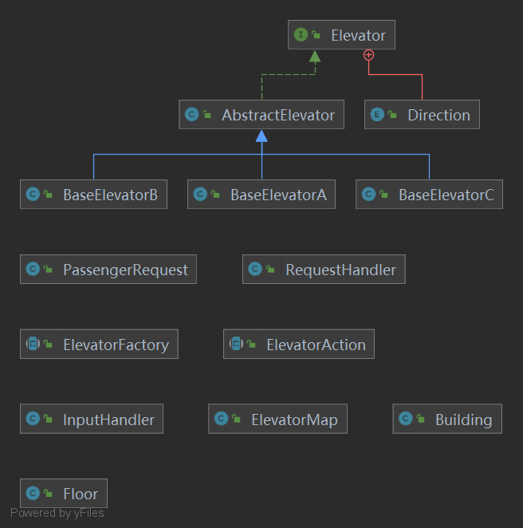
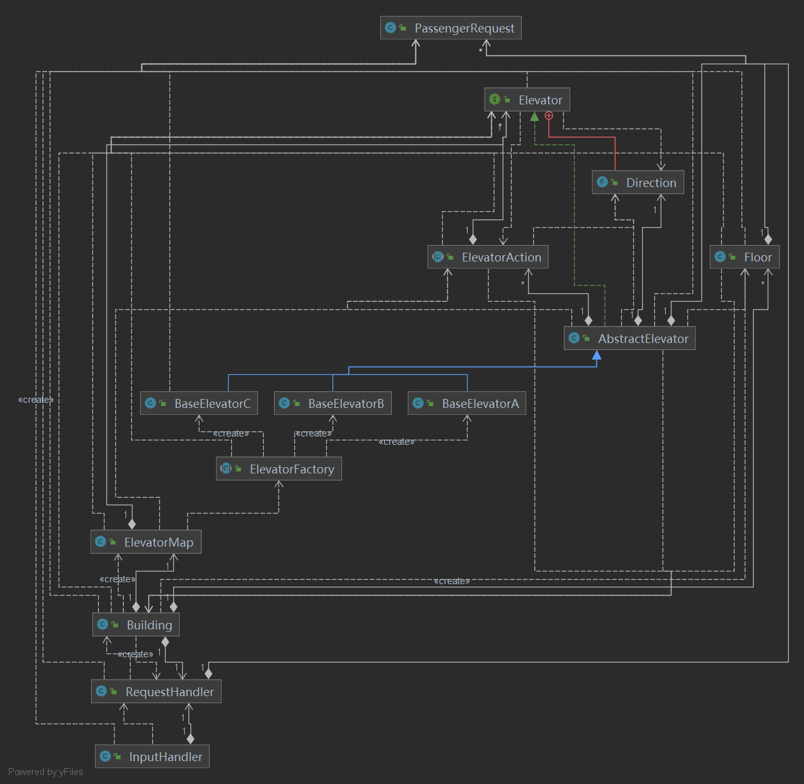
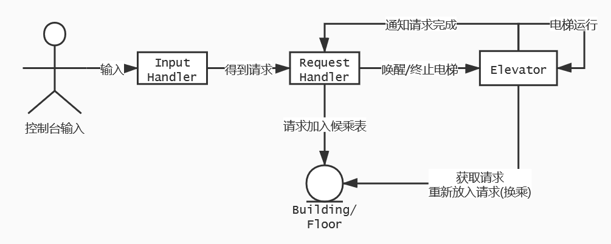

## 一、同步块的设置和锁的选择

### 第五次作业

在本次作业中，我没有采用任何 `synchronized` 块。对于线程之间的共享数据对象采用了阻塞队列（ `BlockingQueue` ）作为存储乘客请求的容器，该容器已经保证了线程安全并且在没有内容时会阻塞等待(从而避免暴力轮询)，所以并不需要自己写同步块和锁。

### 第六次作业

#### 同步输出

本次作业中由于包含了多部电梯，可能出现多部电梯在某个时刻同时输出的情况。官方包给出的输出方法 `TimableOutput.println` 在被调用时会获取当前的相对时间戳并拼接到字符串上输出，其不是原子操作，如多部电梯同时调用但不加任何同步措施，则可能会出现这样的执行顺序：

    [电梯1-获取时间戳]-[电梯2-获取时间戳]-[电梯2-输出]-[电梯1-输出]

从而导致输出结果可能不是按时间戳严格非递减的：

    [   1.1000]ARRIVE-2-1
    [   1.1010]ARRIVE-2-2
    [   1.5010]ARRIVE-3-2
    [   1.5000]ARRIVE-3-1

因此需要对官方的输出方法进行同步：

```java
public static synchronized long println(String message) {
    return TimableOutput.println(message);
}
```

电梯在输出信息时采用同步封装后的 `println` 方法代替直接调用官方包的 `println` 方法。

### 第七次作业

#### 候乘表

在第七次作业中由于不同电梯可到达的楼层不同，对于不同的电梯，其可以运载/捎带的请求也是不同的。由于我的作业采用了电梯自由竞争请求的策略（即指导书中的 "集中式" 调度策略），在该策略下所有电梯共享同一个候乘表，所以第六次作业采用 `BlockingQueue` 的设计不再适用了（队列首的请求不一定能被某些电梯运载），因此我参考了 `ArrayBlockingQueue` (结构较为简单, 插入删除共用一把锁)中关于加锁的部分实现，重新设计了候乘表对象，采用 `ReentrantLock` 实现了加锁逻辑。
在候乘表对象的读写方法中，同步块的设计未采用 `synchronized` 关键字，而是通过 `ReentrantLock` 的 `lock` 方法与 `unlock` 方法手动打造了同步临界区：

```java
private ReentrantLock mutex; // 类属性

// 方法内部
mutex.lock();
try {
    // read and write something
} finally {
    mutex.unlock();
}
```

在线程(电梯或者请求处理器)读写候乘表时，通过 `lock` 方法获得锁，而后对候乘表进行读写（取出请求/插入请求/查询候乘请求个数等），完成读写后释放锁，在 `lock` 与 `unlock` （即 `finally` 块）之间形成了临界区，只能有一个线程进入临界区对共享数据进行读写，保证了候乘表在线程间共享的线程安全性。

## 二、调度器设计

我的三次作业的调度器设计相似，故一并分析，不再分每次作业。

在我的作业中有一个调度器，调度器负责接受从输入线程传来的请求，将其放入候乘表并对电梯进行通知（唤醒等待的电梯）；调度器的另一个功能是当输入结束后由调度器负责适时(即电梯执行完所有请求后)给电梯发出停机指令，从而避免电梯陷入无限等待。电梯被调度器唤醒，但调度器不负责分派请求（请求放在楼层候乘表中由电梯进行自由竞争）。电梯与调度器之间通过信号量进行交互，电梯通过该信号量告知调度器已经完成的请求(个数)，调度器通过该信号量等待电梯完成所有请求，并向电梯发出停机指令。

在第三次作业完成后，事后看来，我的调度器设计有一些 "假"，有一定的设计冗余并且可扩展性并没有想象的高，其起到的作用有些模糊，并且它所在的环节并未较好地支持更换调度策略，或者分派调度请求等。

## 三、第三次作业架构与可扩展性

我的第三次作业主要分为了电梯、楼层候乘表，请求处理器，输入线程等类，类的结构关系见 UML 图。

我的架构设计重心主要放在了功能方面，对于性能没有过多设计（由于我采用的调度策略是让电梯自由竞争候乘表中的请求，所以基本没有在调度算法上花大工夫，强测结果也证明自由竞争在随机数据下的性能是比较优的）

这次作业的可扩展性有好的地方，也有不太好的地方。对于电梯这个实体，有了第一单元的经验，我在这次作业中通过继承来实现不同的电梯，从第二次的同种电梯到第三次的不同种电梯的扩展较好，对支持更多种类的电梯效果也较好，只需从抽象的父类继承一个子类，在子类中设定好参数并重写相应的拆分换乘请求的方法。可扩展性不太好的方面主要包括调度策略难以实现多样化，并且难以从自由竞争修改成分派调度。

UML类图：





UML协作图：（由于主类不是线程，其仅负责启动上述线程而后就结束了，故未在图中体现）



## 四、自己程序的 Bug

我的程序在三次强测与互测中均为出现 bug ，但在本地和中测测出了若干 bug 。

### 第五次作业

本次作业的 Bug 在公测的中测阶段根据评测结果反馈发现。

#### CTLE之LOOK转向轮询

我的电梯采用了 LOOK 调度策略，由于对电梯转向的判定条件写得不严谨（电梯内没有乘客且运行同方向没有请求则转向），当两条请求之间隔了一段较长的 "空窗期" 时，电梯会因为**候乘表中两个方向都无请求**而**不停转向**，由于电梯的转向不耗时间，所以相当于电梯不断进行了**轮询**，大量占用 CPU 从而 CPU Time Limit Exceed.

解决措施：在 LOOK 判定转向时加一个条件，当所有楼层候乘表中均没有请求时电梯应阻塞等待，及时释放 CPU。

#### RTLE之电梯无限等待

该 bug 的产生是由于 de 上一个 bug 引起的。在请求空窗期内，电梯完成现有请求后阻塞等待，但新请求到来时电梯并未被及时唤醒，故后来的请求并没有被执行，而电梯仍然处于等待中。

#### WA之电梯开关门过快

背景：根据本次指导书的设定，乘客是"纸片人"，可以在开关门的窗口期内任意进出，如果开门和关门分别 sleep 0.2s ，而乘客在这两个 0.2s 之间上下，则会导致电梯开关门的窗口期多于 0.4s ，因此我在代码中采用了一种 "量子开关门" 的优化，即开门瞬间进行并**记录下时间戳**，而后进行乘客的上下，在关门时只需 sleep 一个**时间差**补足0.4s即可。

在实现上述量子优化中，我的开门方法中存在如下代码段：

```java
lastOpenTimeStamp = System.currentMillis(); // record the time stamp of open door
TimableOutput.println("OPEN-" + getFloor());
```

该代码段存在的 bug 与官方输出接口的线程不安全原理类似，如果上述两条语句不是连续执行，则会导致**输出的开门时间戳晚于自己记录的时间戳**，而在关门方法中计算 sleep 应补足的时间差是以 `lastOpenTimeStamp` 为基准，故输出结果中**关门与开门之间相差小于 0.4s** ，从而在中测中暴露出了 Wrong Answer.

修复方法：实现"量子电梯"优化时，利用官方输出接口的**返回值**记录时间戳，而不要在自己的代码中调用 `System.currentMillis()` 。

```java
lastOpenTimeStamp = TimableOutput.println("OPEN-" + getFloor());
```


### 第六次作业

本次作业在本地与公测的中测均未发现 BUG 。

### 第七次作业

#### 又轮询了

本次作业由于先前的队列式候乘表的设计不再适用于三种不同到达楼层的特种电梯进行自由竞争，故在刚完成第七次作业时出现了很多轮询：

在原本的阻塞队列设计中，如果一个电梯从队首取出一条请求但并不能运载，则将该请求重新插入回队尾；但如果整个楼只有一条请求，则电梯会重复取出该请求并将其扔回队尾，无限执行该操作直到其他电梯赶到。

解决方案：尝试在原有架构基础上进行修复，均失败，最终重构了候乘表类，将只能单端访问的 `BlockingQueue` 换成了可以随机存取的容器（我采用了 `HashSet` ，也可以采用 `LinkedList` 等），并采用 `ReentrantLock` 类自己加锁来确保线程安全。

## 五、发现别人 Bug 采用的方法

### 测试策略

采用黑箱测试为主 + 手动构造样例为辅进行测试。

手动构造的样例：来自于我在自测过程中卡出自己 bug 的样例或者用来测试自己性能的极端样例。

黑箱测试：由于开始写电梯较晚导致没有时间写评测机了，故直接借用了<del>大佬</del>同学写的评测机进行黑箱测试。

#### 测试策略有效性

由于是多线程，线程之间的执行顺序不确定，故有一些测试点卡出来的 bug 不太容易复现（例如数据线程安全或者一些死锁等）

### 发现线程安全相关问题的策略

我在互测中由于以黑箱测试为主，故并未针对某个人的特定的线程安全 bug 进行测试。在测试过程中多个人的程序并发运行，一定程度上提高了多线程 bug 被复现的概率。

### 测试策略与第一单元的差异

本单元的测试策略与第一单元的差异一是题目本身的差异，要根据电梯的需求和数据特点构造测试样例，并且评测机的答案检查要考虑较多的错误情况；另一方面是要考虑到多线程，为了复现出多线程的 bug 可能需要一定的数据强度以及尽可能在高并发高压力环境下，且不保证复现成功率。

## 六、心得体会

### 线程安全

线程安全方面我在第二单元的作业中做得较为顺利，这主要归功于寒假期间针对多线程进行了一定的预习，通过在 Leetcode 上练习了多线程的题目，对多线程以及与多线程有关的 `synchronized`, `wait-notify` , `BlockingQueue` , `Semaphore` , `ReentrantLock` 等概念进行了初步的了解。同时在设计电梯程序时，较好地采用了生产者消费者的设计模式，在设计缓冲区以及其他线程间的共享数据时有意识地考虑到了线程安全性，从而基本做到了"在一开始就不写出 bug" 而不是写完了再去 debug 。

### 层次化设计

层次化设计方面我做的没有前一个方面好，在第五次作业开始出现了一定程度上的 "过度设计"（例如 "假" 调度器，以及 `ElevatorAction` 这个模型，一开始自以为的可扩展性实际上在后期并没有表现出优势），好在当初的 "过度设计" 并未过于拖累后期的正确性，但是对于性能的优化造成了一定的阻碍（只能自由竞争，很难改成分布式的分派调度，如果强测不是随机数据而是极端数据则性能可能很低），代码的 Metrics 复杂度也出现了多处过高 "爆红" ，代码量也较为冗长。所以在架构设计方面仍然需要多学习。
