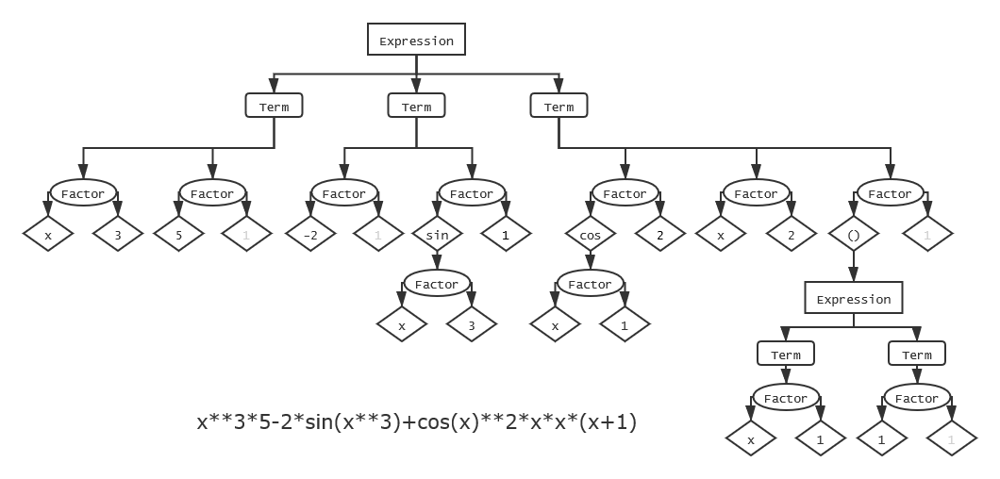

前三周高强度的第一单元作业结束了，终于到了可以缓口气的博客周。本篇博客为第一单元三次作业的总结。

## 一、基于度量来分析程序结构

本人的三次作业架构相似，中途未发生重构，所以本部分直接将三次作业合在一起进行分析。

### 类结构与类图

由于本人作业中使用的类以及存在的继承与接口关系较多，采用 StarUML 或 ProcessOn 手动绘制类图过于繁琐，故采用 IDEA 生成。

第一次作业类图：


第二次和第三次作业类图：


可以看出前后两张类图的差异仅体现在表达式中个体元素 `Item` 的种类不同，其他类的结构没有明显变化。

类结构设计：

- 表达式的存储

  - `Expression` ："表达式"，为一个或若干个 "项" 的代数和。
  - `Term` ："项"，为一个或多个 "因子" 的乘积。
  - `Factor` ："因子"，由底数和指数两部分构成，其中底数的类型任意，为 `Item` 的子类；指数只能是常数 `Constant` ，对于常数因子和表达式因子等不含指数的，人为规定其指数部分为 `1` 。
  - `Item` ：表达式中的基本元素，可以近似对应成表达式树中的叶子节点。
    - `Constant` ：常数，内部数据为一个 `BigInteger` ，支持加减/乘/幂/比较等运算。
    - `Variable` ：变量 "x"
    - `Sine` ：三角函数 $\sin$ ，内部含有一个因子( `Factor` ) 。
    - `Cosine` ：三角函数 $\cos$ ，内部含有一个因子 ( `Factor` ) 。
    - `InnerExpression` ：子表达式（对应"表达式因子"），内部含有一个表达式 ( `Expression` ) 

  这些类之间形成了一个有层次的**树**状结构（在数据结构学过的 "表达式树" 的基础上进行了改进）

  以上所有类均实现(重写)了 `clone` , `equals` , `hashCode`, `toString` 方法。

- 表达式的解析

  - `ExpressionParser` ：表达式解析工厂类，含有一个 `public static` 方法作为总入口，以及若干个 `private static` 方法用于分别解析表达式文法的各个成分。采用**递归下降**法实现，兼具内容解析和格式检查功能。
  - `StringTokenStream` ：对应递归下降文法分析中的 "符号流"，支持提取当前待解析的的符号以及前进到下一个符号。该类实际的实现较为简单，维护了待解析的字符串和一个**下标**，支持从当前下标向前获取连续若干个字符，以及将下标向前移动若干个字符。更加科学的做法是实现一个"分词器" ( `Tokenizer` )，将输入的表达式分成若干 `Token` （例如 `sin` , `**` 等直接作为一整个 `Token` 而不是分立的字符），每次获取一个 `Token` 。
  - `WrongFormatException` ：自定义的 "格式错误" 异常，由表达式解析工厂的解析方法抛出。

- 功能性的接口

  - `Simplifiable` ：该接口含有一个 `simplify` 方法，用来进行基础的合并化简。

    注：

    - 每次调用该方法都会返回一个 **新的** 对象，不会在原来的对象上直接做修改。
    - 该接口仅用于表达式内合并同类项，项内合并相同底数的因子和常数，去掉 1 和 0 等较为基础的合并化简，不涉及三角函数优化等。

  - `Derivable` ：该接口含有一个 `derive` 方法，对表达式树中相应的元素求导，返回求导后的结果。与 `simplify` 类似，每次调用都返回**新的**对象。

  - `MultipleArgument` ：用来管理表达式树中含有多个分叉（即内部含有一个容器）的节点，包括 `Expression` （ `Term` 的代数和）与 `Term`  （ `Factor` 的连乘 ）。

    该接口包含若干管理容器的方法，其中有两个关键的方法：

    - `add` ：向容器中添加一个元素。

      该方法应能够处理重复元素的情况，例如向一个含有项 `<3*x, 2*sin(x)>` 的表达式中添加一个 `3*x` ，最终不能只留下一个 `3*x` 。

    - `merge` ：传入另一个实现了 `MultipleArgument` 的节点对象，将对方容器内的元素合并至自己的容器。例如**两个表达式相加成一个表达式**，或者**两个项相乘成为一个项**。（后来才知道这个方法对应 Java 容器的 `addAll` 方法）

- 其他

  - 主类
  - 调试信息打印类（未在类图中给出）：含有若干 `boolean` 类型的 "开关" 用来控制调试信息的输出。在正式提交的作业中应使调试信息开关为 `false` 。

### 代码复杂度分析

#### 方法复杂度

由于本人作业的类较多，方法数目也较多，所以 `Method Metrics` 生成的表格过长，无法在一屏内完整截图，故只展示总体情况与出现红色的条目。


总体来看，本人作业中整体的复杂程度和耦合程度较低，仅存在少数方法的 `ev(G)` 指数超标。这些 `ev(G)` 较高的方法的共性是含有较多的 `if-else` 分支（因子的输出和项的输出需要考虑很多诸如 "省略1" "省略符号" 等情况；在递归下降解析工厂中对于三角函数和有符号整数的解析方法进行了较多的判断）

#### 类复杂度


总体基本符合高内聚低耦合，但是表达式解析工厂类和"项" ( `Term` ) 类的圈复杂度仍然较高，可以进一步简化。

### 优缺点分析

#### 优点

- 在表达式的存储上采用**树**状结构存储，层次化较好且便于维护与扩展
  - 在普通表达式树的基础上进行了一定的改良（将原本只有二叉的加法/减法/乘法改造成支持多叉的**代数和**/**连乘**），便于进行合并与化简等操作且降低了树的深度
  - 采用 `HashSet` 容器，便于管理同类项的合并等
  - 求导和化简都是顺从树的层次结构的，较好地保证了**正确性**
- 将表达式树节点的特定行为抽象成**接口**
- 采用**递归下降**法进行输入表达式的解析
  - 严格遵守"形式化表述"，层次清晰且不易出错
  - 代码编写简洁，可读性好
  - 可扩展性高
    - 在迭代开发中只需对新增的成分实现相应的解析方法，其余代码无需修改。
  - 便于进行格式检查
    - 无需考虑 WF 的种类，只需要在每种成分的解析方法中加一些判断，当遇到**不符合文法**的内容导致当前成分**无法继续解析**时即为格式错误，直接抛出 Wrong Format 异常。

#### 缺点

- 层次结构不够灵活，存在一定的冗余（过度封装）。
- 性能优化做得不够好，一些化简/优化的方法较为冗长。

附一张本人存储表达式的树状结构示意图：



## 二、分析自己程序的 Bug

本人的三次作业均未在强测及互测中出现 Bug ，但是在中测以及本地测试中三次作业均有发现 Bug ，且均较为明显，因此均较容易修复。

### 第一次作业

由于本人采用 `HashSet` 容器来存储表达式中各个项以及项中的各个因子，这种设计使得表达式中不能出现完全相同的项，项中也不能出现完全相同的因子。因此在化简表达式时，由于一些项在未化简时形态不同（例如 `6*x**3` 和 `2*x*3*x**2`）但化简后完全相同，因此一开始逐项化简后采用 `.collect(Collectors.toSet())` 导出结果时发生了 Hash 冲突从而使得**结果中 "少" 了一项**。

解决办法是去掉 `toSet` 而是采用自己编写的可以判重的 `Expression` 类的 `add` 方法（不要直接 `collect` 也不要用原生 `HashSet` 的 `add` ）。

（后来想到可以用 `HashMap` 代替 `HashSet` 来更好地进行合并同类项，但是本人没有这样重构）

```java
// ------ WRONG ------
Set<Term> simplifiedTermSet = term.stream().map(Term::simplify)
    .collect(Collectors.toSet());
// ------ FIXED ------
Expression simplified = new Expression();
term.stream().map(Term::simplify).forEach(simplified::add);
```

### 第二次作业

在完成正确性要求时(未加三角函数优化)无 bug ，但是在三角函数优化中发现 bug 。

本人只实现了一种较为简单的三角函数优化，将表达式中含有 `sin(x)**2` 和含有 `cos(x)**2` (但不含 `sin(x)**2` )因子的项(去掉三角平方因子)提取到 `HashMap` 中（ key 为该项去掉系数去掉三角平方项的剩余部分， value 为系数），寻找除了常数系数和三角平方因子以外的"变量"部分相同的项，即两个 `HashMap` 的 `keySet` 的交集（例如 `3 * x**2 * sin(x)**2` 与 `5 * x**2 * cos(x)**2`），根据两个系数的大小和正负关系分类讨论进行合并处理。

在实现该三角函数优化时由于写代码粗心，导致完成优化后发现两处 Bug ：

- 对于没能成功合并三角平方的项（例如表达式只含有 `3 * x**2 * sin(x)**2` 但不含有 `3 * x **2 * cos(x)**2` ），由于上一步提取时是以 `< x**2 , 3 >` 的形式进行存储，在还原时**忘记加回正弦因子**从而得到 `3 * x**2` 。
- 在进行了三角合并后应当返回合并之后新生成的 `term` ，**误写成了旧的** 。

### 第三次作业

第三次作业在第二次作业的基础上进行了进一步迭代，由于本人在前两次作业中均已在递归下降解析器中判断了 `WRONG FORMAT` （并已经进行过较充分的测试）且今年的第二次作业已经实现了表达式因子，因此从第二次到第三次作业的迭代开发中进行很少改动即可（几乎只需在输入解析器中修改三角函数的文法并添加对指数范围的判断）。完成第三次作业开发后发现并修复了两处 Bug ：

- 余弦函数 `Cosine` 的求导方法(链式求导)**未对其参数求导**（但是正弦函数 `Sine` 却写了）。由于第二次作业中三角函数内只有 $x$ ，求导结果为 $1$，因此该 Bug 并未影响第二次作业的正确性，但拖到第三次作业却暴露了。
- 在三角函数中含有一个幂函数因子且指数为 $2$ 时（例：`sin(x**2)` ），由于本人在输出幂函数因子（也就是在其 `toString` 方法）为了缩短长度对 `x**2` 进行了特判并转化为 `x*x` ，但是到了三角函数内，**输出 `sin(x*x)`** 却导致了输出结果的格式错误。解决办法为新增一个与 `toString` 类似并且不特殊处理 `x**2` 的方法（该方法仅在三角函数的 `toString` 中用到）

## 三、分析自己发现别人程序 Bug 所采用的策略

### 第一次作业

在第一次作业中本人搭建了测试数据生成器，自动评测机和答案正确性判断程序等工具。其中测试数据生成器基于指导书中表达式的形式化表述，与表达式输入解析器结构近似的递归下降方法用 Java 语言编写，以随机生成为主，但在随机生成时也适当引入了常量池等机制来生成具有一定层次的数据。答案正确性检查器采用 Python 基于 Sympy 库编写，并通过 `re.sub` 对数字前导零和多个连续正负号进行预处理，并利用 Sympy 求导结果和自己程序输出的结果相减并 `simplify` 后判断是否为零来检验正确性。

由于第一次作业要求较为简单，故随机生成的测试数据强度尚可。互测阶段通过自动测试成功 Hack 出来 4 个 Bug.

### 第二、第三次作业

第二次作业中本人修改了答案正确性判断程序，由于引入了三角函数，难以直接 `simplify` 所以采用与课程平台相同的评测手段，进行大量随机取点并比较，但是这种方式在本机自动测试时实测效率略低。

由于本人在第二三次作业中并未做很多优化，因此未能针对优化构造测试数据。互测采用的策略以手工构造的数据为主，包括常见的极端数据以及自己测试过程中遇到过 Bug 的数据。自动测试方面，由于本人没有想到保证数据强度的思路（特别是针对优化的 Hack ），故没有做自动生成，直接借用了一些已有的测试数据（来自同学，讨论区，网络等）。随机数据+自动测试在本人的互测屋中并未起到较大作用，反而是手动构造的特定数据成功 Hack 了同屋的人。后两次作业的互测中本人均只成功 Hack 了两次。

## 四、重构经历总结

本人在本单元三次作业中**并未**重构代码，没有重构经历。

## 五、心得体会

总体来说，本人的作业较良好地采用面向对象的设计，层次化与低耦合提高了作业的正确性以及可扩展性，也保住了较高的作业分数：三次作业强测均获得了 99+ 的强测分数并且互测中未被 Hack 出来任何 Bug ；迭代增量开发的过程也较为顺利；但另一方面，由于一些细节设计的不够灵活，并且存在一定程度的"过度封装"，增加了优化的难度，所以在性能上表现略有逊色：每次作业强测都有性能分薄弱的测试点；在测试数据生成与互测方面投入精力不足。

经过本单元的练习，本人充分体会到了面向对象设计的好处，对 Java 语言的运用也更加熟练（例如 Java 容器的使用，容器的流 ( `stream` ) 式操作，`BigInteger` 类的运用，`Object` 类各方法的应用 ），但是由于几乎没有采用正则表达式，所以对 `Pattern` 和 `Matcher` 类的练习存在较为严重的缺乏。

另外本人对待**性能**也没有投入足够的精力，在确保了正确性的基础上没有花大量的精力去思考如何优化性能，也没有去充分尝试讨论区各位<del>大佬</del>同学提出的优化思路，仅仅做了一些被动的化简（例如合并同类项等）和一个很生硬的 $\sin^2x+\cos^2x$ 模式的处理，没有做如因式分解/因式展开等主动的优化。但是当看到大量的由于卷极致的性能优化从而强测中正确性翻车的例子后，本人还是认为架构和可扩展性才是面向对象设计的重点，即：不要为了一点点性能而在架构上开倒车。为了架构和可维护性优先，在初始版本的设计中甚至可以考虑留出适量的冗余（例如在递归下降解析器中直接写好 Wrong Format 判断而不是留到最后，<del>祭祖课设中提前为流水线留出一些可能的毒瘤数据通路</del> ）。当然，能够提前为未来的扩展"留好接口"也是需要一定的知识储备或经验积累的。

最后希望接下来的 OO 作业能顺利完成（前提是保证身体）