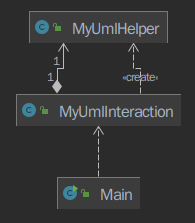
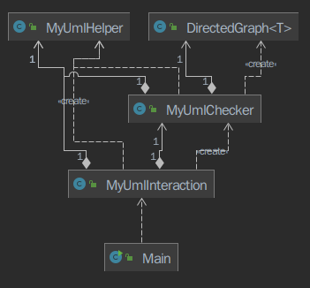

一学期的 OO 终于结课啦！

## 一、第四单元作业架构设计

第四单元整体是要求我们实现一个 UML 解析器。三次作业分别要求我们实现对类图的解析，对顺序图和状态图的解析，对一些条规则进行合法性检查。这一单元与上一个单元类似，解析器程序的大部分（ json 解析，输入命令解析等）均已经由官方包实现，自己只需要实现要求的几个查询接口并实现相应的查询方法即可。

由于本单元对性能没有过多要求（ UML 模型中不超过 400 个元素，查询指令不超过 300 条，并且后两次作业的 CPU 时间均给了 10 秒），不太需要像上一单元一样过多关注性能优化。因此本人仅采用最简单的架构与最为暴力的算法来实现作业要求。

### 第 13、14 次作业




架构非常简单，也并未继承官方包中给的 UML 对象类进行建图等操作，只是直接将构造方法中给出的 elements 存储为 `HashMap` 。虽然没有进行建图，但仍然进行了对继承关系的预处理，将类和接口的继承关系提前建立 `Map` 存储起来。

在查询方法中大量地使用 `stream` 操作来根据要求进行查询 （ 在不考虑性能的前提下， `stream` 真香 ）。下面举一个简单的例子：

```java
// 假设已经用 Map 存储了所有元素的信息(元素 id 和元素对象本身对应)
private Map<String, UmlElement> elements;

// 取得状态 state 经过一步转移能到达的所有状态的名称
// UmlState state;
List<String> subsequence = elements.values().stream()
    .filter(umlElement -> umlElement instanceof UmlTransition)
    .map(umlElement -> (UmlTransition) umlElement)
    .filter(umlTransition -> umlTransition.getSource().equals(state.getId()))
    .map(umlTransition -> umlTransition.getTarget())
    .map(id -> elements.get(id)).map(UmlElement::getName)
    .collect(Collectors.toList());
```

上面的例子简要展示了仅通过一系列 `stream` 操作而没有继承 `UmlClass` 等类进行建图的前提下实现了 UML 解析器的相应查询（例子较为简陋，未考虑错误处理）

`MyUmlHelper` 类：将一些查询过程中可能被多个方法复用的代码拆分成辅助用的方法（例如，根据类名取出类在 UML 模型中对应的元素对象(并能够抛出类不存在/类重名异常)，取出某个类的所有方法/属性，取出类的继承链，根据变量类型对象 `NamableType` 的具体种类提取出类型名等）。本来打算一个 `MyUmlInteraction` 一类到底的，但是由于代码行数超过了 500 行，违反了 checkstyle 的要求所以将辅助用的方法单独拆分成类。

第 14 次作业的顶层结构与第 13 次作业完全相同，未新增新的类，只是添加了相应的查询方法。

### 第 15 次作业

在这次作业中新增了 UML 模型的合法性检查。




同理，由于 `MyUmlInteraction` 与 `MyUmlHelper` 两个类均超过 300 行且接近 400 行，为了保证满足 checkstyle 的 500 行以内的要求，将八个查询方法单独拆分成 `MyUmlChecker` 类。

另外，由于 `R002` (禁止循环继承) 与 `R003` (禁止重复继承) 均涉及到了与图相关的操作（ R003 采用 BFS，R002 采用 Tarjan 强联通分量算法），故不得不先建立继承关系的有向图。这里采用了一个功能相对专一的容器类，以 UML 元素的 id 建立继承关系图，并实现了相应的搜索算法。

（由于架构实在过于简单所以写了很多文字凑一下字数...）

## 二、四个单元中架构设计及 OO 方法理解的演进

第一单元：这一单元主要研究的对象是表达式，由于考虑到需要对表达式进行解析，并且在去年的数据结构中也学习过表达式树，因此较为自然地想到了采用树形结构来存储表达式，根据表达式中成分的层次来设计对象的层次，每个对象对应着一个表达式成分，对象的行为对应表达式的行为。同时在解析表达式方面根据指导书给的文法形式化定义采用层次特点十分明显的递归下降分析法来解析表达式。而对于求导、合并等具有共性的方法则将其抽象出来(成为接口，表达式成分分别实现这些接口)。这一架构的可扩展性十分良好，在三次作业中均未重构，同时递归下降分析法在错误格式处理上具有较好的健壮性。

第二单元：多线程程序设计，难点在于不同对象之间的协作，对共享数据的访问控制等。这一单元相比第一单元引入了更多的设计模式（也许是由于多线程），例如生产者-消费者模式，状态模式，策略模式等。多线程相关的坑(不知道算不算"架构设计")也是这一单元需要重点关注的，例如对共享数据的线程安全访问，避免死锁，利用等待唤醒机制防止轮询等。（在多线程方面， Java 中已经有很多封装好的对象，如 `BlockingQueue` , `Semaphore`, `ReentrantLock`, 等，善用它们可以规避很多线程安全的坑，从而将更多精力用在电梯的调度策略上。 <del>妈妈再也不用担心电梯吃人生孩子了。</del> 

第三单元：从这一单元开始架构设计相比前两个单元难度降低了，这一单元是根据 JML 规格实现社交网络模拟，整体的架构（需要实现哪些类、哪些方法）都是由官方接口及其 JML 规格规定好的。需要自己设计的部分主要是容器的选择以及对时间复杂度的控制。（ JML 规格只是规定了程序的行为需要与规格一致，但并未规定采用的实现方式。例如规格中出现了数组，但实现起来并不一定要用数组，而可能采用 `Map` 等容器；规格中出现了嵌套的 `\forall`, `\exists`, `\sum` 等 "循环" 并不意味着实现也要是嵌套循环）

第四单元：这一单元在架构设计上似乎没什么可说的，就是要理解 UML 图及其元素的含义，以及将官方包中相应的对象与 UML 模型中的元素对应起来。（也可能只是因为自己的设计过于简陋，没有根据 UMLElement 之间的关系自己建图）

## 三、四个单元中测试理解与实践的演进

第一单元：以自动测试为主，由于当时刚刚开学，时间较为充裕，故花了大量的时间编写自己的数据生成器和自动评测机。但是数据生成器强度较弱，并且评测机的正确性检查部分未检查格式，因此单靠自己的测试无法规避第三次作业中可能输出 `sin(x*x)` 的错误情况，仅测出了部分三角函数优化的 bug 。

第二单元：未搭建数据生成器与自动评测机，仅建立了一套简陋的定时输入发射器用于处理电梯的输入。本地测试数据全部为手工生成。由于自己的电梯采取的是自由竞争的策略，没有进行刻意的优化，并且全程采用线程安全容器，因此几乎未发生线程安全相关的错误。本地测试的重点主要针对导致 CPU TLE 的元凶 "暴力轮询"（往往在不经意间就发生了），手工构造的测试数据也大多为若干波请求中间隔有空窗期的模式来测试是否发生轮询。

第三、四单元：由于这两个单元细节特别多并且有唯一的正确答案，因此测试方案以多人对拍为主，手动构造边界样例为辅。对于第三单元，手工构造的测试用例主要针对若干性能瓶颈的方法，通过极端数据测试是否发生 TLE 。而第四单元构造数据则着眼于各种正确的、错误的、边界的可能情况，由于不需要考虑性能所以想到的每种情况均只需构造 1 组数据测试行为是否正确即可。

## 四、课程收获

预习阶段：

- 巩固了一些 Java 语法
  - 容器的使用
  -  `stream` （感谢 [roife](https://www.cnblogs.com/roife/) 的有关 `stream` 的分享）
  - 异常处理
  - 正则表达式
- 体会了面向对象思想之封装

第一单元：

- 根据层次设计类、抽象类、接口及其继承/实现关系
- 递归下降分析法
- 工厂模式
- 用计算机实现在数学中早已习以为常的表达式优化
- "圈复杂度" 等衡量面向对象程序的指标

第二单元：

- 多线程程序的设计
- Java 中多线程相关库的使用
  - 同步互斥 `synchronized` 与等待唤醒 `wait/notify`
  - 线程安全容器 `BlockingQueue` ，`ConcurrentHashMap` 等
  - 可重入锁 `ReentrantLock`
  - 信号量 `Semaphore`
- 提升多线程程序的性能
  - 减少 "轮询" 对 CPU 资源的浪费

第三单元：

-  JML 语法，理解 JML 规格
- 提升程序性能，减少算法时间复杂度
  - 根据需求选择对性能最有利的容器
  - 空间换时间，记忆化结果防止重复计算
  - 复习了图最短路算法

第四单元：

- 理解了 UML 的含义
- 增强了理解谜语人指导书的能力

工具：

- `Intellj IDEA` 集成开发环境
  - 代码风格检查插件 `checkstyle`
- 版本管理工具 `git` 及代码托管仓库 `gitlab` 的使用
- 性能分析工具 `JProfiler`
- 单元测试库 `JUnit`

## 五、对课程的建议

1. 在每单元的第一次作业前发放一些补充的预习资料（例如在第一单元前(寒假)补充递归下降分析法，第二单元前补充多线程编程以及相关库的使用等，第三、四单元分别提前一周发放 JML 与 UML 的相关资料），从而减少每单元第一次作业时由于对相关的背景知识不熟悉造成的跨度大和痛苦。
2. 对于指导书中的 "谜语人" 之处（即需求描述不清，有歧义之处）希望可以描述得更明确一些，尤其是 UML 这细节特别多的单元。<del>刻意增大指导书的理解难度让学生去 "猜需求" 除了浪费时间以外恐怕也没什么收获。</del> 
3. 适当降低前两个单元的性能分占比，让感兴趣且学有余力的同学去尽情优化性能（保留性能相关的奖，或者性能优秀者额外加分），但是不要让性能以及性能分带来的 "卷" 给很多同学们带来焦虑。
4. 希望实验课能够有评测反馈，课后保留指导书并提供参考答案。（否则实验课没什么收获，没有评测反馈也没有参考答案始终感觉不明不白）如果实验课承载着某种考核/考试目的的话，可以在实验课结束后公布评测结果/参考答案。
5. 每单元公开一些同学的优秀代码供大家参考学习（据说去年有这个环节但是今年没了）。曾经在讨论区中有助教表示课程组不鼓励直接分享/交流代码，但是对于一些值得学习的 best practice 放出来供大家学习(而不是抄袭)未尝不是坏事（对于基础差一些的同学来说，把思路转化为代码的过程还是很困难的，很有可能自学的方向完全歪了而不自知，也能过评测但是写法完完全全不优雅）。
6. 希望讨论区可以支持关键字检索或者标签功能，目前的讨论区如果内容多起来则找到某个特定的前人问过的问题（例如关于某个方法或者某个异常的问题）是很低效的。另外希望能有一个公共的讨论区（整个课程总体、每个单元总体）用来进行不针对某次特定作业的通用讨论，如关于 Java 语法 / git 使用 / IDEA 使用等主题。
